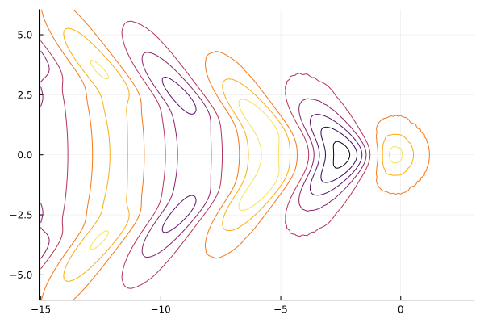

# NumericalShipHydro
Repository for the TU Delft course in Numerical Ship Hydro

Learning Objectives
---
1. Utility of numerical hydrodynamic predictions for maritime systems: ships, ocean platforms, & propulsors
2. Sources of errors in numerical predictions: modelling, truncation, & parametric errors
3. Numerical predictions pipeline: grid generation, parameter selection, solver execution, & results analysis
4. Choosing appropriate solvers based on modelling assumptions and computational limitations
5. Establishing numerical convergence and comparing results to experimental and field data

Potential examples
---
1. Model choices
   - Potential flow Boundary Element Methods (BEMs)
   - Reynolds Averaged Navier-Stokes (RANS) finite-volume solvers
   - Volume-of-Fluid (VOF) surface tracking
   - Scale resolving turbulence and acoustics
2. Case studies
   - Steady ship resistance
   - Added wave resistance
   - Propeller inflow
   - Propeller surface pressures
